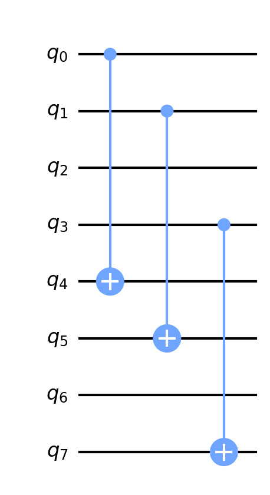

# Qiskit

## Dependencies
```
click
qiskit-aer
qiskit-terra
matplotlib
numpy
pylatexenc
scipy
```

## Supported algorithms
### Simon's algorithm
```
python simons.py --n <n_qbits> --t <target_bit>
```
The implementation for Simon's algorithm used the unitary matrix of the. test circuit `flip_but_bit` to verify correctness.  `flip_but_bit` takes the number of q_bits (`n_qbits`) and a target bit (`target_bit`) as parameters.  It bit-flips the value of all other bits besides `target_bit`.

For example, the below circuit captures a circuit with `n_qbits=4` and `target_bit=2`.  Note that 8 q_bits appear in the circuit as required for Simon's circuit.




### Grover's Search algorithm
```
python grovers_search.py --n_literals <n_literal> --exactly_1_3_sat_formula <sat_formula>
```

Grover's Search is implemented based on the description in section 6 of Introduction to Quantum Computing, Without the Physics with the target problem being to find the assignment of literals such that only one literal is true in each clause of a 3-SAT formula.

The format for the provided 3-SAT formula is a list of list of integers (e.g. `[[1, 2, -3], [1, -2, 3]]`). Positive integers indicate the positive literals and negative integers represent negative literals.